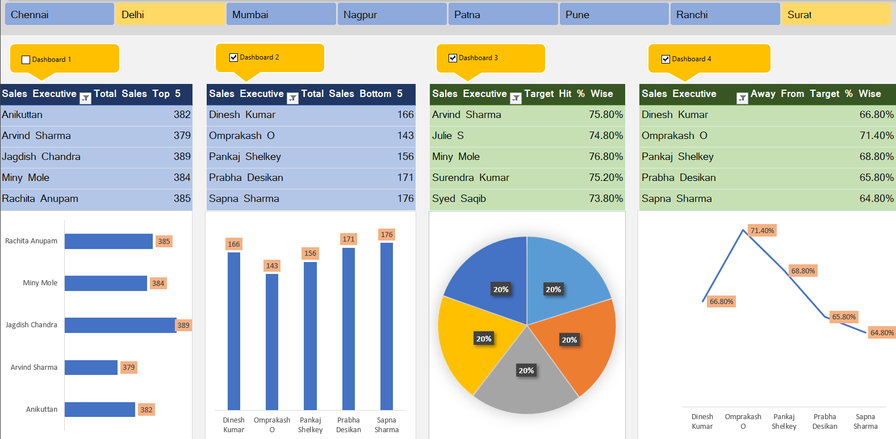

# 💼 Sales Executive Dashboard Analysis (Excel-based)

This project is a professional Excel-based **Sales Executive Performance Dashboard** designed to visualize and analyze sales data across different regions. It highlights top performers, identifies underperformers, and measures success against sales targets.

---

## 🧾 Key Features

✅ Region-wise dashboards for:
- Chennai
- Delhi
- Mumbai
- Nagpur  
- Patna
- Pune
- Ranchi
- Surat

✅ Interactive Dashboard Panels:
- **Top 5 Sales Executives** based on total sales
- **Bottom 5 Sales Executives**
- **Target Hit % Wise**: Shows top employees achieving their targets
- **Away from Target % Wise**: Identifies sales reps not meeting targets

✅ Visual Components:
- Bar charts for sales comparisons  
- Line and pie charts for target analysis  
- Clean UI with slicers, toggle buttons, and filters  
- Macro-enabled features for interactivity (`.xlsm` file)

---

## 📷 Dashboard Preview

---

## 📁 Files Included

- `Sales_Executive.xlsm` – Excel file containing the complete dashboard with macros  
- `Sales_Executive.png` – High-resolution screenshot of the dashboard

---

## 🚀 How to Use

1. **Download or Clone** this repository.
2. Open the file `Sales_Executive.xlsm` using **Microsoft Excel (2016 or later)**.
3. Enable **Macros/Content** when prompted.
4. Use slicers and dropdowns to interact with dashboards per city or analysis type.

---

## 🛠️ Tools Used

- Microsoft Excel
- Pivot Tables & Charts
- Conditional Formatting
- Slicers & Timelines
- VBA Macros (for interactivity)

---

## 📌 Benefits

- Quick insights into sales executive performance
- Supports decision-making for sales strategies
- No external software or plugins required—just Excel!

---

👨‍💻 Author
Himanshu – B.Tech Final Year Student, passionate about Sales Executive Data Analysis.
Department: Information Technology, GNIOT
